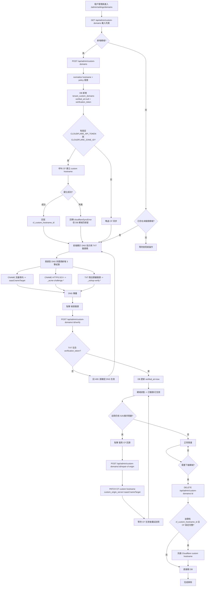
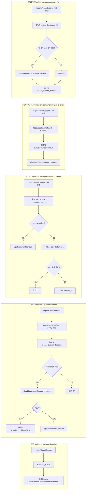
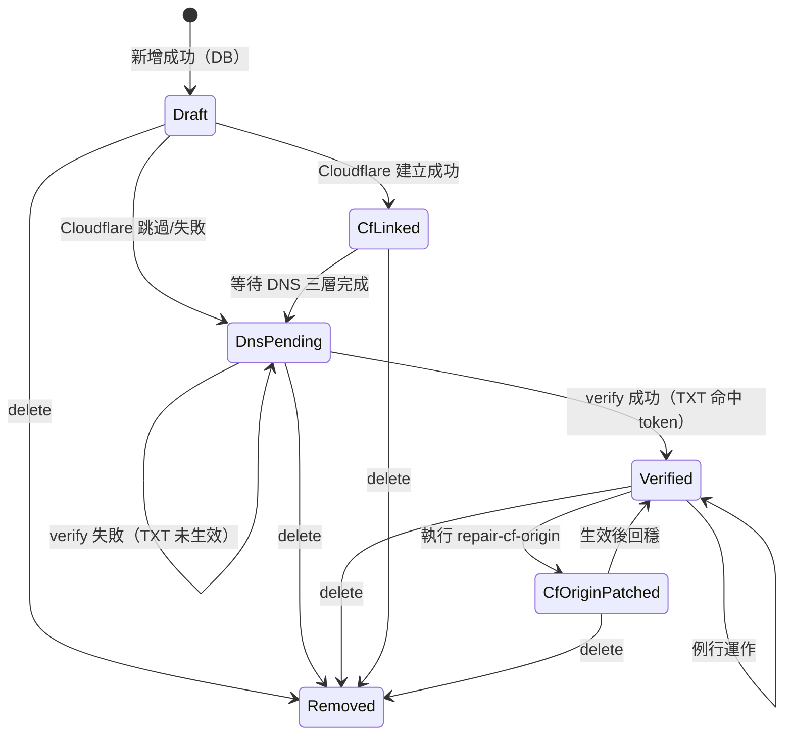

# 租戶 Custom Domains 全流程圖

本文對齊目前程式實作，整理租戶在後台 `自訂網域` 的完整流程，含：

- 新增網域（DB + Cloudflare Custom Hostname）
- DNS 三層設定（流量 CNAME / HTTPS DCV / 商店 TXT）
- 驗證啟用（`verify`）
- Cloudflare 回源修補（`repair-cf-origin`）
- 移除網域（`delete`）

---

## 1) 端到端主流程（Tenant Admin）

---

## 2) 後端 API 流程圖（Admin Custom Domains）

---

## 3) 狀態機（單一網域）

---

## 4) 實務備註

- `verification_token` 僅在新增當下回傳給前端，若遺失需移除後重建。
- `verify` 只檢查商店歸屬 TXT（`_oshop-verify.<hostname>`），不等於 HTTPS 一定已完成。
- Cloudflare 建立失敗不會回滾 DB（網域仍保留，可後續修復）。
- `repair-cf-origin` 主要處理來源 TLS SNI 不符造成的 `525 SSL handshake failed`。
